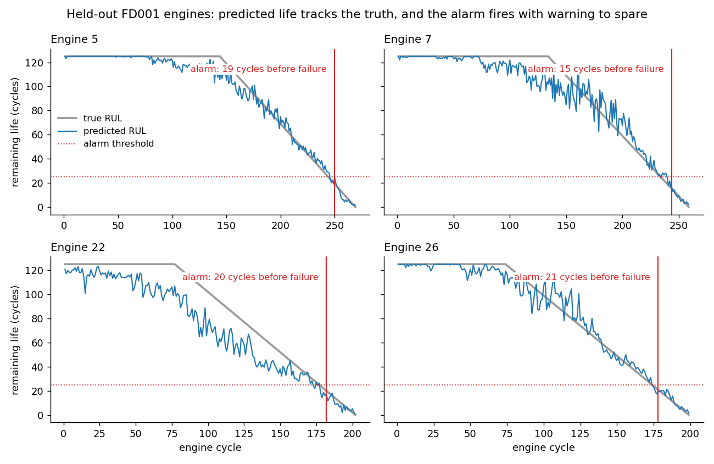

# Predictive Maintenance Platform

## What it is

A system that predicts **how many more cycles a jet engine can run before it
fails** (its Remaining Useful Life, or RUL), and then decides **when to raise a
maintenance alarm**.

It uses the real **NASA C-MAPSS** turbofan dataset (43 MB, not a generator or a
subset; see [data/CMAPSS/SOURCE.md](data/CMAPSS/SOURCE.md)). C-MAPSS is NASA's
simulation of jet engines wearing out. Each engine logs 21 sensors (temperatures,
pressures, fan speeds) once per flight cycle until it fails.

The dataset comes in four parts, **FD001 to FD004**. Each part is a separate fleet
of engines, and they get harder along two axes:

- **Operating conditions:** 1 means every flight has the same altitude, speed and
  throttle. 6 means flights vary across six settings, so sensor readings jump
  around for reasons unrelated to wear.
- **Fault modes:** 1 means only the high-pressure compressor wears out. 2 means
  either the compressor or the fan can wear out.

| | operating conditions | fault modes | train engines | test engines |
|---|---|---|---|---|
| FD001 | 1 | 1 | 100 | 100 |
| FD002 | 6 | 1 | 260 | 259 |
| FD003 | 1 | 2 | 100 | 100 |
| FD004 | 6 | 2 | 249 | 248 |

FD001 is the easiest (one condition, one fault). FD004 is the hardest (six
conditions, two faults). A method that only reports FD001 hasn't shown much.



**How to read this chart** (`python make_demo.py`): four engines the model never
saw in training, each from its first flight to failure. The x-axis is the engine's
age in cycles, and the y-axis is how many cycles it has left.

- **Grey = the true remaining life.** It is flat at 125 early on on purpose: a
  healthy engine looks the same at 300 or 200 cycles left, so the target is capped
  and simply means "healthy". Then it falls to 0 at failure.
- **Blue = the model's prediction**, made every cycle. It is noisy early on and
  most accurate near the end, which is where the decision is made.
- **Red dotted = the alarm level** (25 cycles left). **Red vertical = when the
  alarm fires**: the prediction has to stay below 25 for 5 cycles in a row. The
  label is the warning time: 15-21 cycles on these engines.

On engine 22 the model guesses too low for much of its life, but the alarm still
fires at the right time, because it only reacts near the end.

## Skills and keywords

**Machine learning:** predictive maintenance, remaining useful life (RUL) prediction, time-series regression, prognostics and health management (PHM), gradient boosting (scikit-learn HistGradientBoosting), deep learning (PyTorch LSTM, temporal convolutional network / TCN), ensemble learning, feature engineering, ablation study, hyperparameter tuning, mixture of experts, unsupervised clustering, bootstrap confidence intervals, cost-sensitive decision making, anomaly alarm policy

**MLOps:** model registry, model lineage, MLflow, data drift and concept drift detection (PSI), automated retraining triggers, model monitoring, model serving (FastAPI, REST API), batch scoring, Dockerfile, CI/CD (GitHub Actions), pytest

**Edge / deployment:** ONNX export, int8 quantization (ONNX Runtime), inference latency benchmarking (p50/p99), edge AI, IIoT

**Data:** NASA C-MAPSS turbofan engine data, sensor data, Python, pandas, NumPy, matplotlib

## What I did

1. **Predicted RUL** with two kinds of model: a gradient-boosted tree (GBM) on
   hand-built sensor features, and deep sequence models (LSTM, then a TCN).
2. **Turned predictions into an alarm.** A model that says "23 cycles left" is not
   a decision. I built an alarm rule (threshold + "k readings in a row"), tuned it
   by cost, and measured warning time and false alarms.
3. **Checked my own numbers.** The FD002/FD004 results looked too good, so I ran
   an ablation to find which design choice produced them.
4. **Built what deployment needs:** drift monitoring with a retrain trigger, a
   model registry, a scoring service, and ONNX export for edge devices.
5. **Tested what breaks on a real fleet.** I damaged the data one way at a time
   (fewer failures, label noise, sensor drift) and measured the cost of each.

42 tests. CI runs on every push.

## Results

**Prediction error** (RMSE in cycles, lower is better):

| | GBM | LSTM | published reference* |
|---|---|---|---|
| FD001 | **12.03** | 14.34 | 12.61 |
| FD002 | **13.17** | 17.15 | 22.36 |
| FD003 | **12.77** | 15.25 | 12.64 |
| FD004 | **14.48** | 15.26 | 23.31 |

\*Zheng et al. 2017 and Li et al. 2018, quoted, not reproduced. These are older
papers used as a reference point, not the state of the art. I do not claim to
beat the field.

**The alarm** (the number a maintenance planner cares about):

| | FD001 | FD002 | FD003 | FD004 |
|---|---|---|---|---|
| average warning before failure | 16.9 cycles | 20.4 | 14.4 | 28.9 |
| engines warned at least 10 cycles ahead | 100% | 100% | 100% | 100% |
| false alarms per engine lifetime | 0.05 | 0.00 | 0.00 | 0.30 |

**Other results:**

- **Simple trees beat deep learning here.** The GBM won on all four sub-datasets
  and trained in 5-12 seconds vs 87-442 for the LSTM. A tuned TCN also lost
  (16.46 vs 14.76), and a blended ensemble gave it zero weight.
- **Edge model:** int8 ONNX is 73 KB, p99 latency 0.50 ms on one CPU thread, and
  differs from the full model by 0.23 cycles on average.
- **Registry catches a silent failure.** Shipping the model with the wrong
  normaliser gives RMSE 36.1 instead of 14.8: bad, but not bad enough for anyone
  to notice. The registry refuses it.
- **The input monitor cannot see every kind of drift.** When engines start
  wearing out faster but the sensor readings look the same, the input monitor
  stays silent. A second monitor, which compares predictions to actual failures,
  catches it, but only after 5 engines have failed.
- **Biggest real-world risk:** having only 8 recorded failures instead of a full
  history adds +9.0 RMSE. Label noise barely matters until it gets large.

Full numbers: [RESULTS.md](docs/RESULTS.md), [EXTENSIONS.md](docs/EXTENSIONS.md),
[COMPLETION.md](docs/COMPLETION.md), [DEPLOYMENT_REALITY.md](docs/DEPLOYMENT_REALITY.md).

## Why alarm at 25 cycles left, and not earlier?

**The model predicts all along.** The blue line is a prediction every cycle. The
alarm level is a separate choice: when to *act* on the prediction.

**Early predictions are not reliable.** For most of its life an engine is healthy,
and its sensors look like any other healthy engine. Wear starts slowly and only
shows clearly near the end. That is why the error is about 3 cycles near failure
and much larger early on. An alarm at "100 cycles left" would often be wrong.

**Alarming early has a cost too.** Every early alarm throws away working engine
life, and alarms that fire too often get ignored by crews, which is its own
safety risk.

**"Failure" here does not mean a crash.** In C-MAPSS, failure means the engine
has worn past its safety margin and should stop flying. So 25 cycles of warning
means 25 flights to schedule the repair first. At this setting **every engine got
at least 10 cycles of warning and none were missed.**

**25 is a setting, not a limit.** For more safety margin, raise it (FD004 already
uses 45). The cost analysis showed the best setting did not change when a failure
was made 5× or 100× more expensive, because nothing was being missed. It only moved
with how much engine life you are willing to throw away. So an earlier alarm is a
business and safety choice, not something the model prevents.

**Catching the moment wear starts is a different problem.** That is anomaly
detection: flag the engine as soon as it stops looking healthy. My
[condition-monitoring project](https://github.com/riya0920/bearing-condition-monitoring)
does this. A real system would use both: anomaly detection says "this engine has
started to wear, watch it", and remaining-life prediction says "about 25 flights
left, schedule the repair".

## Key decisions and why

**Normalise sensors per operating condition.** This is the main reason FD002 and
FD004 score well. The ablation shows it is worth about 2.4-2.8 RMSE on the
6-condition datasets and nothing on the 1-condition ones, which is what you would
expect. It closes most of the gap to the published numbers.

**Keep the engine's cycle count as a feature, and say so.** It helps by about 0.8
RMSE. You always know a machine's running hours, so it is fair, but the published
sequence models do not use it. Without it, FD002/FD004 still score 16.3 and 18.1,
better than the quoted 22.4 and 23.3.

**Measure warning time on held-out training engines, not the test set.** Test
engines are cut off before they fail, so there is no failure to measure a warning
against. I kept 20 training engines aside per dataset for this. That is a small
sample, so the warning time is reported with bootstrap intervals (P05 = 17 cycles,
range 15-21).

**Cap the RUL target at 125 and don't worry about the exact number.** Not capping
is 54x worse on the scoring metric. Between caps of 90 and 200 the maintenance cost
barely moves (0.08 per engine), even though RMSE alone made cap 90 look 40% better.

**Require "k readings in a row" before alarming.** A single low prediction is often
noise. The persistence table shows why k=5 or k=8 was chosen, instead of just
picking a number.

**The cost that matters is not the one people ask about.** The chosen alarm setting
did not change when the failure cost moved from 5:1 to 100:1, because nothing was
being missed. It changed a lot with the value of the engine life thrown away by
replacing parts early. That is the number to get from finance.

**Retrain only when drift is large, lasting, and widespread.** "Widespread" is what
tells a stale model apart from one broken sensor.

**Reject short histories at serving time.** An engine with fewer readings than the
model needs is refused instead of padded, because padding invents history the
engine does not have and still returns a confident-looking number.

**Stop trying to use fault modes.** Two attempts (hard split, then a soft mixture)
found the two fault modes are real in the sensor data but give almost no
prediction gain (0.16 RMSE at best). Without maintenance records naming the failed
part, this is not worth more effort.

## Bugs I found in my own work

Running things end to end caught six mistakes, all fixed:

- The concept-drift test changed nothing (it scaled a value that was always 0).
- The drift control compared two different groups, so every feature looked drifted.
- A drift check on only 20 rows was just noise.
- One control trained and tested on the same rows.
- The sensor-drift test drifted the wrong dataset, and by almost nothing.
- The residual monitor used the wrong standard error, so it was about 4.5x too
  insensitive and never fired.

## Limits

- **No edge hardware.** Only the desktop latency is measured. The ARM numbers are
  scaled estimates and are marked as projected.
- **Docker not run.** The Dockerfile and compose file are written but have never
  been built.
- **C-MAPSS is a simulation, and a generous one.** Every engine runs to failure.
  A real fleet may have 4 failures ever, and all the data problems happen at once.
  See [DEPLOYMENT_REALITY.md](docs/DEPLOYMENT_REALITY.md).
- **20 held-out engines** per dataset is a small sample for warning-time numbers.

## How to run

```bash
pip install -r requirements.txt
```

```bash
python train.py
```

Main results, about 18 minutes on CPU. Writes [docs/RESULTS.md](docs/RESULTS.md)
from the measured numbers. Add `--report-only` to rebuild the doc without retraining.

```bash
python make_demo.py
```

```bash
python ablation.py
```

```bash
python extend.py
```

```bash
python complete.py
```

`make_demo.py` draws the chart at the top. `ablation.py` is the FD002/FD004 audit, `extend.py` is drift and fault modes, and
`complete.py` is the registry, TCN, serving, and deployment-reality runs (~45 min).

## Layout

```
src/cmapss.py     loading, RUL target, condition normalisation, sensor selection
src/features.py   rolling and trend features, sequence windows
src/metrics.py    RMSE, PHM08 score, error by horizon, alpha-lambda
src/models.py     GBM and LSTM
src/sequence_models.py  TCN and the ensemble
src/alarm.py      alarm rule, cost model, warning time, false alarms
src/drift.py      input drift monitor and retrain trigger
src/conceptdrift.py  residual monitor for drift the inputs can't show
src/faultmode.py, src/mixture.py  fault-mode discovery and the mixture model
src/registry.py   model registry (model + normaliser checked together)
src/serve.py      scoring service
src/robustness.py deployment-reality experiments
src/edge.py       ONNX export, int8, latency benchmark
deploy/           Dockerfile and compose (not built)
registry/         saved models with their normalisers
tests/            42 tests
```
